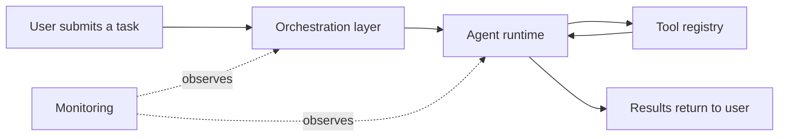
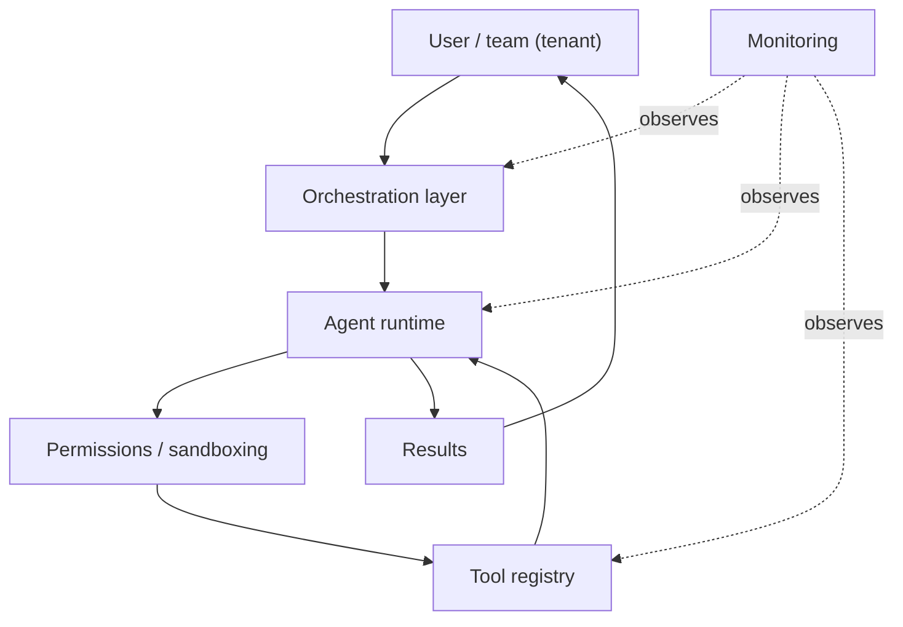

<!-- order: 18 -->
# AI Agent Platform Engineer: Hands-On Project Tutorials

This course is a series of hands-on projects. You learn each idea at the moment you need it, while building the thing.

Follow the projects in order. Each one hands off a skill or artifact to the next, ending in the Final Capstone.


## Before you start: set up your notebook

This course runs in **Google Colab**, a free Jupyter notebook in your browser and the standard workspace for AI and data work. There's nothing to install.

1. Go to [colab.research.google.com](https://colab.research.google.com) and sign in with a Google account.
2. Give each project its own notebook: choose **File → New notebook**, then click the title at the top to rename it after the project.
3. Notebooks have two kinds of cells. **Code cells** run Python: type or paste code, then press **Shift + Enter**. **Text cells** hold your notes and written answers: choose **Insert → Text cell**.
4. Install libraries in a code cell with `%pip install ...`. The `%` form installs them into the notebook you're using.
5. Put each code block from a project in its own code cell, in order, and run them top to bottom. When a later step changes earlier code, edit that cell and run it again.
6. To use a file you downloaded, such as a CSV, drag it into the **Files** panel (the folder icon on the left). Files your code creates appear there too. Colab clears them when the session ends, so download anything you want to keep, or connect Google Drive from the same panel.

Prefer to work on your own computer? The same notebooks run in JupyterLab or in VS Code with the Jupyter extension.

**Your Claude API key.** Projects that call Claude need an API key from [console.anthropic.com](https://console.anthropic.com). API use is paid and billed by how much text you send and receive. The requests in this course are small, but set a low monthly spending limit in the console before you begin. Keep the key out of your code: in Colab, click the **key icon** in the left sidebar, add a secret named `ANTHROPIC_API_KEY`, and turn on notebook access. Then run this cell at the top of every notebook that calls Claude:

```python
import os
from google.colab import userdata
os.environ["ANTHROPIC_API_KEY"] = userdata.get("ANTHROPIC_API_KEY")
```

**A few projects run on your computer.** Projects that build a web app, a job queue, or a scheduled task keep running in the background, and a notebook can't host that. Those projects say so at the top and use a code editor and your terminal instead: VS Code, plus Terminal on a Mac or PowerShell on Windows.

---

## Project 1 (Module 1): Diagram the Architecture of an Agent Platform

**Goal:** Plan the platform before writing any platform code, so every later project has a place to plug into.

**Step 1: Create the project notebook.**
Create a new notebook for this project (**File → New notebook**) and name it `agent_platform_diagram_project`.

**Step 2: Define the platform's purpose.**
Write one sentence: what kinds of agents will this platform run, and for whom? Example: "A platform that lets internal teams build and run task-automation agents with access to company tools."

**Step 3: Understand the difference between an agent and an agent platform.**
An **agent** is a single AI system that plans and takes actions toward a goal; an **agent platform** is the infrastructure that lets many agents (possibly built by different people) run, access tools, and be managed centrally.

**Step 4: List the platform's core components.**
- **Agent runtime**: where agent logic actually executes.
- **Tool registry**: a catalog of tools agents can call.
- **Orchestration layer**: manages multiple agents and tasks.
- **Permissions/sandboxing**: controls what agents can access.
- **Monitoring**: tracks what agents are doing.

**Step 5: Consider multi-tenancy.**
**multi-tenant** means the platform serves multiple separate users or teams, each of whose agents and data must stay isolated from the others.

**Step 6: The request flow.**
A task moves through the platform like this, with monitoring watching every stage:



**Step 7: Note a security consideration.**
Write one sentence: what's the worst thing an agent on this platform could do if given too much unchecked access, and how would you prevent it?

**Step 8: The full platform architecture.**
Here are all the components from Steps 4 to 6 in one picture, with the request flowing top to bottom and monitoring observing everything:



### Final Project Structure
```text
agent_platform_diagram_project/
│
├── platform_purpose.md
├── architecture_diagram.png
```

### What You Learned
- ✅ The difference between an agent and an agent platform
- ✅ Core platform components (runtime, registry, orchestration, permissions, monitoring)
- ✅ Multi-tenancy considerations
- ✅ Diagramming a request flow through the platform
- ✅ Baseline security thinking for agent platforms
- ✅ Producing a complete architecture diagram

### Portfolio Project
**AI Agent Platform Architecture Diagram**: Designed a labeled architecture diagram for a multi-tenant agent platform, covering runtime, tool registry, orchestration, permissions, and monitoring components.
**Skills:** Systems Architecture, Platform Design, Security Thinking, Technical Documentation.

**Deliverable:** A platform architecture diagram with all core components and a documented security consideration.

---

## Project 2 (Module 2): Build a Basic Tool-Calling Script

**Goal:** Build the smallest working unit, one agent calling one tool, before scaling to anything more complex.

**Step 1: Create the project notebook.**
Create a new notebook for this project (**File → New notebook**) and name it `tool_calling_project`.
```python
%pip install requests
```

**Step 2: Write one simple tool function.**
Add a **code cell**, paste in the code below, and run it with **Shift + Enter**.
```python
def get_weather(city):
    # in a real implementation, this would call a weather API
    return f"The weather in {city} is 72°F and sunny."
```

**Step 3: Describe the tool for the model.**
```python
tool_definition = {
    "name": "get_weather",
    "description": "Get the current weather for a given city.",
    "input_schema": {
        "type": "object",
        "properties": {"city": {"type": "string", "description": "The city name"}},
        "required": ["city"]
    }
}
```
The **input_schema** tells the model exactly what arguments the tool expects and their types.

**Step 4: Send a request with the tool available.**
```python
import os
import requests

response = requests.post(
    "https://api.anthropic.com/v1/messages",
    headers={
        "x-api-key": os.environ["ANTHROPIC_API_KEY"],
        "anthropic-version": "2023-06-01",
        "content-type": "application/json",
    },
    json={
        "model": "claude-sonnet-5",
        "max_tokens": 300,
        "tools": [tool_definition],
        "messages": [{"role": "user", "content": "What's the weather like in Tokyo?"}]
    }
)
print(response.json())
```

**Step 5: Parse the tool call from the response.**
```python
for block in response.json()["content"]:
    if block["type"] == "tool_use":
        tool_name = block["name"]
        tool_input = block["input"]
        print(f"Model wants to call {tool_name} with {tool_input}")
```

**Step 6: Execute the tool and get the result.**
```python
if tool_name == "get_weather":
    result = get_weather(**tool_input)
print(result)
```

**Step 7: Send the tool result back to the model.**
```python
import os
follow_up = requests.post(
    "https://api.anthropic.com/v1/messages",
    headers={
        "x-api-key": os.environ["ANTHROPIC_API_KEY"],
        "anthropic-version": "2023-06-01",
        "content-type": "application/json",
    },
    json={
        "model": "claude-sonnet-5",
        "max_tokens": 300,
        "tools": [tool_definition],
        "messages": [
            {"role": "user", "content": "What's the weather like in Tokyo?"},
            {"role": "assistant", "content": response.json()["content"]},
            {"role": "user", "content": [{"type": "tool_result", "tool_use_id": block["id"], "content": result}]}
        ]
    }
)
print(follow_up.json()["content"][0]["text"])
```
A **tool_result** message feeds the tool's output back into the conversation, letting the model use it to compose a final natural-language answer.

**Step 8: Test with a request that shouldn't trigger the tool.**
```python
"messages": [{"role": "user", "content": "What's 2+2?"}]
```
Confirm the model answers directly without calling `get_weather`.

### Final Project Structure
```text
tool_calling_project/
│
├── tool_calling.py
```

### What You Learned
- ✅ Defining a tool with a clear input schema
- ✅ Sending a request with tools available to the model
- ✅ Parsing a model's tool call from the response
- ✅ Executing the tool and capturing its result
- ✅ Sending the tool result back for a final response
- ✅ Testing both tool-triggering and non-triggering cases

### Portfolio Project
**Basic Tool-Calling Script**: Implemented the full tool-calling round trip, from tool definition through model request, parsing, execution, and result round-trip, with tested positive and negative cases.
**Skills:** LLM APIs, Tool Calling, Python, Agentic AI Fundamentals.

**Deliverable:** A working tool-calling script demonstrating the full request-parse-execute-respond cycle.

---

## Project 3 (Module 3): Build a Single-Purpose AI Agent

**Goal:** Turn the Project 2 script into a full agent with planning and memory, able to take multiple steps toward a goal, not just one tool call.

**Step 1: Create the project notebook.**
Create a new notebook for this project (**File → New notebook**) and name it `single_agent_project`.
Copy in `tool_calling.py` from Project 2.

**Step 2: Define 2–3 tools for a single-purpose agent.**
Add a **code cell**, paste in the code below, and run it with **Shift + Enter**.
```python
def search_notes(query):
    return f"Found 2 notes matching '{query}'."

def create_note(title, content):
    return f"Created note: {title}"

def list_notes():
    return "Notes: Meeting prep, Grocery list"
```

**Step 3: Understand the agent loop concept.**
An **agent loop** repeatedly asks the model "given everything so far, what's the next step?", calling tools as needed, until the model decides the task is complete.

**Step 4: Implement the agent loop.**
Add a **code cell**, paste in the code below, and run it with **Shift + Enter**.
```python
def run_agent(user_goal, max_steps=5):
    messages = [{"role": "user", "content": user_goal}]
    for step in range(max_steps):
        response = call_model_with_tools(messages, tool_definitions)
        content = response["content"]
        messages.append({"role": "assistant", "content": content})

        tool_calls = [b for b in content if b["type"] == "tool_use"]
        if not tool_calls:
            return content  # model gave a final answer, no more tools needed

        for call in tool_calls:
            result = execute_tool(call["name"], call["input"])
            messages.append({"role": "user", "content": [
                {"type": "tool_result", "tool_use_id": call["id"], "content": result}
            ]})
    return "Max steps reached without completion."
```
`max_steps` is a **safety limit**: capping how many actions the agent can take before stopping, regardless of whether it's "done."

**Step 5: Test with a single-step goal.**
```python
run_agent("Search my notes for 'meeting'.")
```

**Step 6: Test with a multi-step goal.**
```python
run_agent("Check if I have a note about groceries, and if not, create one.")
```

**Step 7: Add simple memory across the conversation.**
Confirm the `messages` list accumulates across steps (as shown in Step 4), so the agent can reference earlier tool results in later decisions within the same task.

**Step 8: Log each step of the agent's reasoning.**
```python
print(f"Step {step}: calling {[c['name'] for c in tool_calls]}")
```

### Final Project Structure
```text
single_agent_project/
│
├── agent_tools.py
├── agent.py
```

### What You Learned
- ✅ The agent loop pattern (repeated act-observe-decide cycles)
- ✅ Implementing a bounded agent loop with a step safety limit
- ✅ Testing single-step vs. multi-step goal completion
- ✅ Maintaining conversation memory across agent steps
- ✅ Logging agent reasoning for debuggability

### Portfolio Project
**Single-Purpose AI Agent**: Built a bounded agent loop capable of multi-step tool use and reasoning toward a goal, with conversation memory and step-by-step logging.
**Skills:** Agentic AI, Python, LLM APIs, Tool Calling, Agent Design.

**Deliverable:** A working single-purpose agent, tested on both single-step and multi-step goals.

---

## Project 4 (Module 4): Build a Platform That Registers and Runs Multiple Tools

**Goal:** Scale from one agent to a registry of tools multiple agents can use, the first real platform component.

**Step 1: Create the project notebook.**
Create a new notebook for this project (**File → New notebook**) and name it `tool_registry_project`.

**Step 2: Design the tool registry data structure.**
Add a **code cell**, paste in the code below, and run it with **Shift + Enter**.
```python
class ToolRegistry:
    def __init__(self):
        self.tools = {}

    def register(self, name, function, description, input_schema):
        self.tools[name] = {
            "function": function,
            "description": description,
            "input_schema": input_schema,
        }
```
A **registry** is a central catalog that stores things (here, tools) so they can be looked up by name rather than hardcoded.

**Step 3: Add registration and retrieval methods.**
```python
    def get_tool_definitions(self):
        return [
            {"name": name, "description": t["description"], "input_schema": t["input_schema"]}
            for name, t in self.tools.items()
        ]

    def execute(self, name, **kwargs):
        return self.tools[name]["function"](**kwargs)
```

**Step 4: Register several tools.**
```python
registry = ToolRegistry()
registry.register("get_weather", get_weather, "Get current weather for a city.",
                   {"type": "object", "properties": {"city": {"type": "string"}}, "required": ["city"]})
registry.register("search_notes", search_notes, "Search saved notes.",
                   {"type": "object", "properties": {"query": {"type": "string"}}, "required": ["query"]})
```

**Step 5: Update your Project 3 agent loop to use the registry.**
```python
def run_agent(user_goal, registry, max_steps=5):
    tool_definitions = registry.get_tool_definitions()
    ...
    result = registry.execute(call["name"], **call["input"])
```

**Step 6: Test adding a new tool without modifying the agent.**
```python
registry.register("create_note", create_note, "Create a new note.", {...})
run_agent("Create a note called 'Test' with content 'Hello'.", registry)
```

**Step 7: Support multiple agents sharing the same registry.**
```python
weather_agent_goal = "What's the weather in Paris?"
notes_agent_goal = "Search my notes for 'project'."
run_agent(weather_agent_goal, registry)
run_agent(notes_agent_goal, registry)
```

**Step 8: Document the registry's public interface.**
Add a **text cell** headed `README` and write your notes in it.
Note the `register`, `get_tool_definitions`, and `execute` methods, and how a new tool would be added.

### Final Project Structure
```text
tool_registry_project/
│
├── registry.py
├── agent.py
├── README.md
```

### What You Learned
- ✅ Designing a tool registry data structure
- ✅ Generating tool definitions dynamically from a registry
- ✅ Decoupling agent logic from specific tool implementations
- ✅ Adding new tools without modifying agent code
- ✅ Supporting multiple agents sharing one registry
- ✅ Documenting a platform component's interface

### Portfolio Project
**Multi-Tool Agent Registry**: Built a tool registry system decoupling agent logic from tool implementations, supporting dynamic tool addition and multiple agents sharing a common tool catalog.
**Skills:** Software Architecture, Python, Agentic AI Platforms, API Design.

**Deliverable:** A working tool registry with multiple registered tools, used by at least two different agent goals without code changes.

---

## Project 5 (Module 5): Build a Queue-Based Agent Execution System

**Goal:** Add the infrastructure needed to run agents at scale, beyond one agent running synchronously in your terminal.

> **This project runs on your computer, not in a notebook.** It builds something that keeps running in the background (a web app, a job queue, or a scheduled task), which a notebook can't host. Make a project folder on your computer, open it in VS Code, and save each code block as the file named in its step. Run the commands in your terminal. Everything you built in the notebooks carries over.

**Step 1: Create the project notebook.**
```bash
mkdir queue_execution_project
cd queue_execution_project
pip install redis rq
```

**Step 2: Understand why queuing matters.**
A **task queue** holds pending jobs until a **worker** is free to process them, decoupling "submitting a task" from "executing a task."

**Step 3: Set up a local Redis instance.**
```bash
# Using Docker, if available:
docker run -d -p 6379:6379 redis
```
**Redis** is an in-memory data store commonly used as the backing store for task queues because of its speed.

**Step 4: Define the agent task as a queueable function.**
```bash
nano tasks.py
```
```python
def run_agent_task(user_goal):
    from agent import run_agent
    from registry import registry
    return run_agent(user_goal, registry)
```

**Step 5: Enqueue a task.**
```bash
nano submit_task.py
```
```python
from redis import Redis
from rq import Queue
from tasks import run_agent_task

q = Queue(connection=Redis())
job = q.enqueue(run_agent_task, "What's the weather in Berlin?")
print(f"Job queued: {job.id}")
```
`enqueue` submits the task and returns immediately with a **job ID**, without waiting for the task to finish.

**Step 6: Start a worker to process the queue.**
```bash
rq worker
```
A **worker** is a separate process that pulls jobs off the queue and actually executes them.

**Step 7: Check job status and results.**
```python
from rq.job import Job
job = Job.fetch(job.id, connection=Redis())
print(job.get_status())
print(job.result)
```

**Step 8: Test with multiple concurrent tasks.**
```python
for goal in ["Weather in Rome?", "Search notes for 'todo'", "Weather in Cairo?"]:
    q.enqueue(run_agent_task, goal)
```
Run two workers simultaneously and confirm tasks are processed in parallel, not strictly one at a time.

### Final Project Structure
```text
queue_execution_project/
│
├── tasks.py
├── submit_task.py
```

### What You Learned
- ✅ Why task queues decouple submission from execution
- ✅ Setting up Redis as a queue backing store
- ✅ Enqueuing agent tasks non-blockingly
- ✅ Running workers to process queued tasks
- ✅ Checking job status and retrieving results
- ✅ Verifying concurrent processing with multiple workers

### Portfolio Project
**Queue-Based Agent Execution System**: Built a Redis/RQ-backed task queue for running agent tasks asynchronously, with job status tracking and verified concurrent execution across multiple workers.
**Skills:** Task Queues, Redis, Distributed Systems Fundamentals, Python, Agentic AI Platforms.

**Deliverable:** A working queue-based execution system, tested with multiple concurrent agent tasks and verified parallel processing.

---

## Project 6 (Module 6): Build an Evaluation Suite for Agent Reliability

**Goal:** Test agent behaviors before trusting them in production, the discipline that separates a working demo from a dependable platform.

**Step 1: Create the project notebook.**
Create a new notebook for this project (**File → New notebook**) and name it `agent_evaluation_project`.
Copy in `agent.py` and `registry.py` from Projects 3 and 4.

**Step 2: Build a test set of agent goals.**
Add a **text cell** headed `test_goals` and write your notes in it.
Write 10–15 goals covering: simple single-tool tasks, multi-step tasks, ambiguous goals, and goals with no relevant tool available.

**Step 3: Define success criteria per test.**
Add a **text cell** headed `evaluation_criteria` and write your notes in it.
For each goal, write what a correct outcome looks like (which tool(s) should be called, roughly what the final answer should contain).

**Step 4: Run the test suite.**
Add a **code cell**, paste in the code below, and run it with **Shift + Enter**.
```python
results = []
for goal in test_goals:
    output = run_agent(goal, registry)
    results.append({"goal": goal, "output": output})
```

**Step 5: Score correctness.**
Add a **text cell** headed `scoring` and write your notes in it.
For each result, compare against your Step 3 criteria and mark pass/fail/partial.

**Step 6: Test hallucination handling.**
Include a goal like "Search my notes for something that doesn't exist" and confirm the agent reports the absence honestly rather than inventing a plausible-sounding but false result.

**Step 7: Test failure recovery.**
Simulate a tool that raises an exception, and confirm the agent handles it gracefully (reports the failure) instead of crashing the whole loop.

**Step 8: Write the evaluation report.**
Add a **text cell** headed `evaluation_report` and write your notes in it.
Structure: Test set → Pass/fail/partial rates → Hallucination findings → Failure recovery findings → Recommendations.

### Final Project Structure
```text
agent_evaluation_project/
│
├── test_goals.md
├── evaluation_criteria.md
├── run_evaluation.py
├── scoring.md
├── evaluation_report.md
```

### What You Learned
- ✅ Building a diverse agent test set (easy, hard, ambiguous, unsupported)
- ✅ Defining measurable success criteria per test
- ✅ Running and scoring a full evaluation suite
- ✅ Testing hallucination handling specifically
- ✅ Testing graceful failure recovery
- ✅ Writing an evaluation report with reliability recommendations

### Portfolio Project
**Agent Reliability Evaluation Suite**: Built a systematic evaluation suite testing agent correctness, hallucination handling, and failure recovery across diverse goal types, with a scored reliability report.
**Skills:** AI Evaluation, Test Engineering, Python, Agentic AI Reliability.

**Deliverable:** A complete evaluation suite with pass/fail scoring and a written reliability report.

---

## Project 7 (Module 7): Add Access Control and Audit Logging to an Agent Platform

**Goal:** Secure and govern what agents are allowed to do, closing the loop back to Project 1's security consideration.

**Step 1: Create the project notebook.**
Create a new notebook for this project (**File → New notebook**) and name it `access_control_project`.
Copy in `registry.py` from Project 4.

**Step 2: Define permission levels for tools.**
Add a **code cell**, paste in the code below, and run it with **Shift + Enter**.
```python
PERMISSION_LEVELS = {
    "get_weather": "public",
    "search_notes": "user",
    "send_email": "restricted",
}
```
Tagging each tool with a **permission level** lets the platform decide who (or which agents) can invoke it.

**Step 3: Extend the registry to check permissions.**
```python
class ToolRegistry:
    def execute(self, name, user_permission_level, **kwargs):
        required_level = PERMISSION_LEVELS.get(name, "restricted")
        if not self._has_access(user_permission_level, required_level):
            raise PermissionError(f"Access denied to tool: {name}")
        return self.tools[name]["function"](**kwargs)

    def _has_access(self, user_level, required_level):
        hierarchy = {"public": 0, "user": 1, "restricted": 2}
        return hierarchy[user_level] >= hierarchy[required_level]
```
This implements **least privilege**: by default, access must be explicitly granted rather than assumed.

**Step 4: Test permission enforcement.**
```python
registry.execute("send_email", user_permission_level="public", to="test@test.com")  # should fail
registry.execute("get_weather", user_permission_level="public", city="Paris")  # should succeed
```

**Step 5: Add audit logging for every tool call.**
Add a **code cell**, paste in the code below, and run it with **Shift + Enter**.
```python
import json, datetime

def log_tool_call(agent_id, tool_name, arguments, allowed, result=None):
    entry = {
        "timestamp": str(datetime.datetime.now()),
        "agent_id": agent_id,
        "tool": tool_name,
        "arguments": arguments,
        "allowed": allowed,
        "result": str(result)[:200] if result else None,
    }
    with open("audit_log.jsonl", "a") as f:
        f.write(json.dumps(entry) + "\n")
```

**Step 6: Wire audit logging into the registry.**
```python
def execute(self, name, agent_id, user_permission_level, **kwargs):
    required_level = PERMISSION_LEVELS.get(name, "restricted")
    allowed = self._has_access(user_permission_level, required_level)
    log_tool_call(agent_id, name, kwargs, allowed)
    if not allowed:
        raise PermissionError(f"Access denied to tool: {name}")
    result = self.tools[name]["function"](**kwargs)
    log_tool_call(agent_id, name, kwargs, allowed, result)
    return result
```

**Step 7: Add a sandbox restriction for risky tools.**
```python
def sandboxed_execute(name, **kwargs):
    if PERMISSION_LEVELS.get(name) == "restricted":
        return f"[SANDBOX MODE] Would execute {name} with {kwargs}, but not actually run."
    return registry.execute(name, **kwargs)
```
A **sandbox** here means simulating an action's effects without actually performing it, useful for testing agent behavior involving high-risk tools without real consequences.

**Step 8: Review the audit log after a test run.**
```python
!cat audit_log.jsonl
```
Confirm it clearly shows which calls were allowed, which were denied, and by which agent.

### Final Project Structure
```text
access_control_project/
│
├── permissions.py
├── registry.py
├── audit_log.py
├── audit_log.jsonl
```

### What You Learned
- ✅ Defining permission levels for tools
- ✅ Implementing least-privilege access checks
- ✅ Testing both denied and allowed access cases
- ✅ Building structured audit logging
- ✅ Logging both successful and denied tool calls
- ✅ Sandboxing risky tools for safe testing

### Portfolio Project
**Agent Platform Access Control & Audit System**: Implemented least-privilege permission enforcement and structured audit logging for a tool registry, including a sandbox mode for safely testing high-risk tool behavior.
**Skills:** Access Control, Security Engineering, Audit Logging, Python, Agentic AI Platforms.

**Deliverable:** A permission-enforced registry with a complete, reviewed audit log of allowed and denied tool calls.

---

## Final Capstone: Build a Multi-Agent Platform

**Goal:** Combine every project above into one complete platform supporting tool registration, task orchestration, monitoring, and access control, this is an integration exercise, not a new build.

**Step 1: Create your capstone notebook.**
Create a new notebook for this project (**File → New notebook**) and name it `capstone_project`.
Copy in the final versions of your code from Projects 2–7.

**Step 2: Start from your Project 1 architecture diagram.**
Confirm each component (runtime, registry, orchestration, permissions, monitoring) has a concrete implementation from the projects you've already built.

**Step 3: Wire in the tool registry (Project 4).**
Register at least 4–5 tools spanning different permission levels.

**Step 4: Wire in queue-based execution (Project 5).**
Submit agent tasks through the queue rather than running them synchronously.

**Step 5: Wire in access control and audit logging (Project 7).**
Ensure every tool call, whether allowed or denied, is checked and logged.

**Step 6: Run your Project 6 evaluation suite against the full platform.**
Reuse your test goals and criteria, but now test agents running through the complete queued, permissioned system.

**Step 7: Test multi-agent, multi-user behavior.**
Submit tasks from at least two different simulated "users" with different permission levels, and confirm the platform enforces isolation and permissions correctly for each.

**Step 8: Write the final capstone report.**
Add a **text cell** headed `capstone_report` and write your notes in it.
Combine your Project 1 diagram, evaluation results, and audit log findings into one write-up: what you built, how reliable and secure it is, and what you'd improve next.

### Final Project Structure
```text
capstone_project/
│
├── architecture_diagram.png
├── registry.py
├── permissions.py
├── audit_log.py
├── agent.py
├── tasks.py
├── submit_task.py
├── evaluation_report.md
├── audit_log.jsonl
├── capstone_report.md
```

### What You Learned
- ✅ Integrating tool registration, queuing, permissions, and monitoring into one platform
- ✅ Running agents through a complete, queued, permissioned execution path
- ✅ Testing multi-agent, multi-user isolation
- ✅ Re-running a reliability evaluation against a fully integrated system
- ✅ Documenting a complete agent platform for a real audience

### Portfolio Project
**Multi-Agent Platform (Capstone)**: Built a complete agent platform combining a shared tool registry, queue-based task execution, permission-enforced access control, audit logging, and a reliability evaluation suite, tested across multiple simulated users.
**Skills:** Agentic AI, Distributed Systems, Access Control, Task Queues, Python, Platform Engineering.

**Deliverable:** A complete, tested, multi-agent platform, plus a written capstone report connecting it back to every project that built it.
