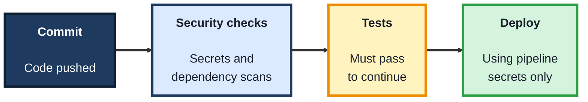
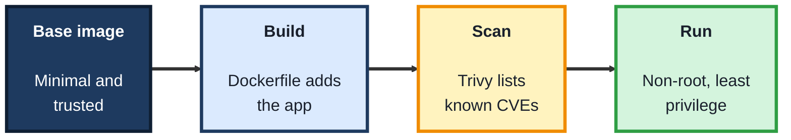
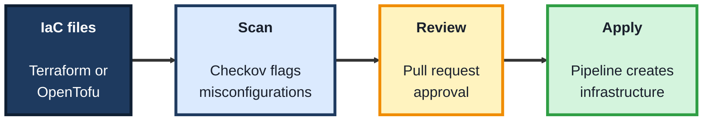

<!-- order: 9 -->
## Module 9: DevOps Security

**Tools needed for this module:** a free [GitHub](https://github.com) account, [Docker Desktop](https://www.docker.com/products/docker-desktop/), and a terminal. You'll install three free, open source scanners along the way: [Gitleaks](https://github.com/gitleaks/gitleaks) (secrets), [Trivy](https://trivy.dev) (container images), and [Checkov](https://www.checkov.io) (infrastructure code). On a Mac, `brew install gitleaks trivy` covers the first two, and `pip install checkov` installs the third.

### Topic 9.1: Securing the Pipeline

#### Concept

**DevOps** joins building software and running it into one continuous flow: code is committed, tested, packaged, and deployed automatically by a **CI/CD pipeline**. That pipeline holds the keys to production, so it's a prime target. **DevSecOps** means building security checks into the pipeline itself, so problems are caught on every change instead of in a yearly audit.

- A **secret** is any credential that grants access: API keys, passwords, tokens, and cloud keys; a secret committed to a repository should be treated as leaked, even if it's deleted later, because it stays in the history
- **Pipeline secrets** (such as GitHub Actions **encrypted secrets**) keep credentials out of code; workflows read them at run time as `${{ secrets.NAME }}`
- **Least privilege** applies to pipelines too: a workflow should get only the permissions it needs, set with the `permissions:` key
- **Secret scanning** checks code and history for credentials before they spread; **Gitleaks** is a common open source scanner
- **Dependency scanning** (such as GitHub's **Dependabot**) flags libraries with known vulnerabilities and proposes updates

#### Structure at a Glance


- "Shift left" means moving checks earlier, into the pipeline and even onto the developer's machine, where problems are cheapest to fix
- If a secret leaks, removing it from the code is not enough: **revoke and replace it** first, then clean up

#### Where you'd actually use this

A developer pastes a cloud access key into a config file to test something quickly and pushes it. A secret scan in the pipeline fails the build within a minute; the team revokes the key and moves it into pipeline secrets before anyone outside can find it.

#### Lab

1. **Create a new private GitHub repository** and clone it to your computer.
2. **Add a fake secret on purpose:** create `config.py` containing a clearly fake value such as `API_KEY = "sk_test_fake_1234567890abcdef"` and commit it.
3. **Scan the repository and its history** with Gitleaks, then read what it reports:
   ```bash
   gitleaks detect --source . -v
   ```
4. **Store a value properly:** in the repository's **Settings → Secrets and variables → Actions**, add a secret named `DEMO_TOKEN` with any made-up value, then add a workflow at `.github/workflows/check.yml` that uses it without printing it:
   ```yaml
   name: Check
   on: [push]
   permissions:
     contents: read
   jobs:
     check:
       runs-on: ubuntu-latest
       steps:
         - uses: actions/checkout@v4
         - name: Confirm the secret is available
           env:
             DEMO_TOKEN: ${{ secrets.DEMO_TOKEN }}
           run: test -n "$DEMO_TOKEN" && echo "Secret is set"
   ```
5. **Turn on Dependabot alerts** in the repository's security settings, and write two sentences on what you'd do if the fake key in step 2 had been real.

#### Checkpoint
You've watched Gitleaks catch a committed secret, used a pipeline secret in a workflow with read-only permissions, and can explain why a leaked secret must be revoked, not just deleted.

#### Quiz
1. What is DevSecOps?
2. Why is deleting a committed secret from the code not enough?
3. How does a GitHub Actions workflow read a secret without it being in the code?
4. What does the `permissions:` key do in a workflow?
5. What does "shift left" mean?

*Answers: 1) Building security checks into the DevOps pipeline so they run automatically on every change. 2) It remains in the repository history and may already have been copied, so it must be revoked and replaced. 3) Through encrypted repository secrets, referenced as `${{ secrets.NAME }}` at run time. 4) Limits what the workflow's token is allowed to do, applying least privilege. 5) Moving checks earlier in the process, where problems are cheaper and faster to fix.*

---

### Topic 9.2: Container Security

#### Concept

Most modern software ships in **containers**: a package holding the app plus everything it needs to run. Containers are built from **images**, and every image starts from a **base image** that brings its own operating system packages, each of which can carry known vulnerabilities. Securing containers means choosing small, trusted base images, scanning images before they ship, and not running them with more power than they need.

- An **image** is a read-only template, described by a **Dockerfile**; a **container** is a running copy of an image
- A **minimal base image** (such as a `-slim` variant) contains fewer packages, which means fewer vulnerabilities and a smaller attack surface
- An **image scanner** such as **Trivy** lists known vulnerabilities (CVEs) in an image's packages, graded by severity
- Containers should run as a **non-root user**, so a compromised app can't take over the whole container
- **Pinning versions** (for example `python:3.12-slim` rather than `python:latest`) makes builds repeatable and changes deliberate

#### Structure at a Glance


- Scanning belongs in the pipeline, set to fail the build on critical findings, so vulnerable images never reach production
- Many findings are fixed simply by moving to a newer, smaller base image and rebuilding

#### Where you'd actually use this

A security review asks how many known vulnerabilities your production image carries. A Trivy scan shows most come from a full-size base image; switching to a slim variant cuts the list sharply, and the pipeline now blocks any image with critical findings.

#### Lab

1. **Scan a full-size and a slim base image,** and compare how many vulnerabilities each reports by severity:
   ```bash
   trivy image python:3.12
   trivy image python:3.12-slim
   ```
2. **Write a small Dockerfile** for any simple app that starts from `python:3.12-slim`, and add a non-root user:
   ```dockerfile
   FROM python:3.12-slim
   RUN useradd --create-home appuser
   WORKDIR /home/appuser
   COPY app.py .
   USER appuser
   CMD ["python", "app.py"]
   ```
3. **Build it and scan your own image:**
   ```bash
   docker build -t demo-app .
   trivy image demo-app
   ```
4. **Confirm it runs as non-root:** `docker run --rm demo-app whoami` should print `appuser`.
5. **Write a short finding:** the difference between the two base images, the highest-severity issue in your image, and what you'd change.

#### Checkpoint
You've compared a full and a slim base image with Trivy, built an image that runs as a non-root user, and scanned it yourself.

#### Quiz
1. What is the difference between an image and a container?
2. Why prefer a minimal base image?
3. What does Trivy report?
4. Why run containers as a non-root user?
5. Why pin image versions instead of using `latest`?

*Answers: 1) An image is a read-only template; a container is a running copy of it. 2) Fewer packages mean fewer vulnerabilities and a smaller attack surface. 3) Known vulnerabilities (CVEs) in the image's packages, graded by severity. 4) So if the app is compromised, the attacker has limited power inside the container. 5) Builds become repeatable, and upgrades happen deliberately rather than by surprise.*

---

### Topic 9.3: Infrastructure as Code Security

#### Concept

**Infrastructure as Code (IaC)** describes servers, networks, and storage in text files, using tools such as **Terraform** or its open source fork **OpenTofu**, so infrastructure is created the same way every time and reviewed like any other code. That also means a misconfiguration, such as a storage bucket open to the internet, can be written, reviewed, and caught before anything is created.

- **Misconfiguration** is the most common cause of cloud breaches: public storage, open network ports, missing encryption, or overly broad permissions
- An **IaC scanner** such as **Checkov** reads configuration files and flags risky settings before they're deployed
- **Policy as code** turns security rules ("no public buckets", "encryption on by default") into automated checks that run in the pipeline
- **Drift** is when the live environment no longer matches the code because someone changed it by hand; IaC makes drift visible and fixable
- **State files** record what IaC tools have created and can contain sensitive values, so they must be stored securely, never committed to a public repository

#### Structure at a Glance


- Scanning IaC catches a public bucket in a pull request, minutes after it's written, instead of after data has leaked
- The same review habits you use for application code (small changes, a second reviewer, automated checks) apply to infrastructure

#### Where you'd actually use this

An engineer adds a storage bucket for log files and forgets to block public access. Checkov fails the pull request with a clear message, the setting is fixed in the review, and the bucket is never exposed.

#### Lab

You only write and scan files here; nothing is created in a real cloud account, so no cloud account or cost is needed.

1. **Create a folder** called `iac-lab` with a file `main.tf` describing a storage bucket with no security settings:
   ```hcl
   resource "aws_s3_bucket" "logs" {
     bucket = "my-demo-logs-bucket"
   }
   ```
2. **Scan it with Checkov** and read the failed checks:
   ```bash
   checkov -d iac-lab
   ```
3. **Fix two findings:** add a public access block for the bucket, and turn on server-side encryption, using the resources Checkov's messages point to. Re-run the scan and confirm those checks now pass.
4. **Add a `.gitignore`** in the folder that excludes `*.tfstate` and `*.tfstate.*`, and write one sentence on why.
5. **Write a short policy** of three rules your team's infrastructure must always follow, and note which Checkov checks enforce each one.

#### Checkpoint
You've scanned an insecure IaC file, fixed at least two misconfigurations until their checks pass, and written three infrastructure security rules with the checks that enforce them.

#### Quiz
1. What is Infrastructure as Code?
2. What is the most common cause of cloud breaches?
3. What does Checkov do?
4. What is drift?
5. Why must state files be kept out of public repositories?

*Answers: 1) Describing infrastructure such as servers, networks, and storage in text files, so it's created consistently and reviewed like code. 2) Misconfiguration, such as public storage, open ports, missing encryption, or overly broad permissions. 3) Scans IaC files and flags risky settings before they're deployed. 4) When the live environment no longer matches the code because of manual changes. 5) They record what's been created and can contain sensitive values.*

---

## Module 9 Completion Checklist
- [ ] Caught a deliberately committed fake secret with Gitleaks
- [ ] Used a pipeline secret in a GitHub Actions workflow with read-only permissions
- [ ] Turned on Dependabot alerts for a repository
- [ ] Compared a full and a slim base image with Trivy
- [ ] Built and scanned an image that runs as a non-root user
- [ ] Scanned an insecure IaC file with Checkov and fixed two findings
- [ ] Written three infrastructure security rules and the checks that enforce them
