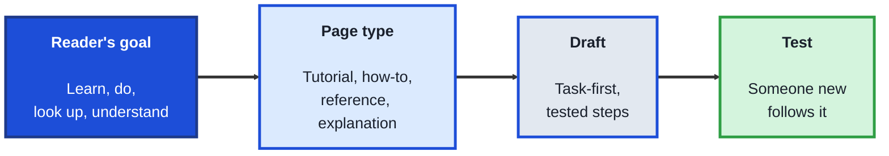
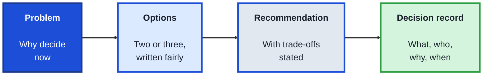
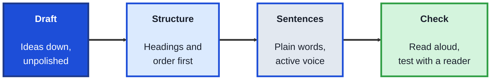

<!-- order: 4 -->
## Module 4: Technical Writing

**Purpose of this module:** Write documentation, decisions, and updates that people can actually use. Technical writers, project coordinators, and tech leads spend much of their week writing, and clear writing is often the fastest way a non-coder makes a technical team faster.

**Tools needed for this module:** A document tool (Google Docs, Notion, or any word processor) and a free [GitHub](https://github.com) account for the README lab. No coding required.

### Topic 4.1: Writing Documentation

#### Concept

Documentation is how a team's knowledge outlives any one person. Good documentation starts from the reader's task, not the writer's knowledge: someone arrives with a goal (install this, fix that, understand why), and the page exists to get them there. Different goals need different kinds of page, and mixing them is the most common reason documentation feels hard to use.

- A **tutorial** teaches a beginner by walking them through a complete, working example from start to finish
- A **how-to guide** gives the steps to complete one specific task, for a reader who already knows the basics
- A **reference** page lists facts to look up, such as settings, commands, or fields, organised for scanning rather than reading
- An **explanation** covers the why: background, design choices, and trade-offs
- A **README** is the front door of a project: what it is, who it's for, how to start, and where to get help

#### Structure at a Glance

- Before writing, name the reader and their goal in one sentence; if you can't, the page will wander
- Every set of steps should be tested by following it exactly, ideally by someone who didn't write it

#### Where you'd actually use this

A new team member spends two days getting a project running because setup lives in old chat messages. You write a README with a tested how-to for setup, and the next person is running it within an hour.

#### Lab

1. **Pick a real tool or process** you know well, such as submitting expenses, setting up an app, or running a meeting template.
2. **Write one sentence** naming the reader and the goal: "A new team member who needs to…"
3. **Write a how-to guide** for it: a short title that states the task, one line on prerequisites, then numbered steps, each starting with a verb.
4. **Create a GitHub repository** and write its README with four sections: what this is, who it's for, how to get started, and where to get help.
5. **Have someone follow your how-to** without your help, and note every place they paused, asked a question, or went wrong. Revise those steps.

#### Checkpoint
You have a tested how-to guide revised from a real reader's attempt, and a README with all four sections.

#### Quiz
1. What are the four kinds of documentation page, and what goal does each serve?
2. What should a README cover?
3. Why should documentation start from the reader's task?
4. What is the best way to check a set of steps?
5. Why does mixing page types make documentation harder to use?

*Answers: 1) Tutorials teach a beginner through a complete example; how-to guides complete one task; reference pages hold facts to look up; explanations cover the why. 2) What the project is, who it's for, how to get started, and where to get help. 3) Readers arrive with a goal, and the page exists to get them there, not to record everything the writer knows. 4) Have someone who didn't write them follow the steps exactly and note where they struggle. 5) A reader looking for one quick task has to dig through background, and a learner gets a list of facts instead of guidance.*

---

### Topic 4.2: Writing for Decisions

#### Concept

Teams make expensive decisions: which tool to buy, how to design a feature, whether to delay a launch. Written decision documents make those choices clearer, fairer, and easier to revisit, because everyone reviews the same options and reasons instead of whoever spoke last in a meeting.

- A **decision document** (also called a proposal or design doc) states the problem, the options, a recommendation, and the trade-offs
- A **decision record** is a short, dated note of what was decided, by whom, and why, kept so future readers don't reopen settled questions
- **Meeting notes** that matter capture decisions and action items (who does what, by when), not a transcript
- Writing **options fairly**, including the ones you don't recommend, builds trust and exposes weak reasoning
- A clear **ask** tells readers exactly what you need from them and by when: approval, feedback, or awareness

#### Structure at a Glance

- Put the recommendation and the ask near the top; busy readers may read only the first paragraph
- A decision without a written record tends to be re-argued within months

#### Where you'd actually use this

Your team keeps debating which project-tracking tool to adopt. A two-page decision document compares three tools against agreed criteria, gets approval in one review, and its decision record answers the question when a new manager asks six months later.

#### Lab

1. **Choose a real decision** your team, club, or organisation faces, or recently faced.
2. **Write a one-page decision document** with five headings: problem, options (at least two), criteria, recommendation, and the ask.
3. **Describe each option fairly**, including one real advantage of every option you don't recommend.
4. **Write the decision record** as if the decision was made: date, decision, decision-maker, and the main reasons, in under 150 words.
5. **Take notes at a real meeting** that record only decisions and action items, each action with an owner and a date.

#### Checkpoint
You have a decision document with fairly described options and a clear ask, a matching decision record, and one set of decision-focused meeting notes.

#### Quiz
1. What sections should a decision document include?
2. What is a decision record, and why keep one?
3. What should meeting notes capture?
4. Why describe options you don't recommend fairly?
5. Where should the recommendation and the ask go, and why?

*Answers: 1) The problem, the options, the criteria, a recommendation with trade-offs, and the ask. 2) A short, dated note of what was decided, by whom, and why; it stops settled questions being reopened. 3) Decisions and action items, each with an owner and a date. 4) It builds trust and exposes weak reasoning, and readers can check you've considered alternatives. 5) Near the top, because many readers only read the opening.*

---

### Topic 4.3: Editing for Clarity

#### Concept

First drafts are for getting ideas down; editing is where writing becomes useful. Clear technical writing uses plain words, short sentences, and a structure the reader can scan. Editing is a skill in its own right, and teams value people who can turn a confusing page into a clear one.

- **Plain language** uses the simplest word that is still accurate, and explains a technical term the first time it appears
- **Active voice** names who does what ("the system sends an email") instead of hiding it ("an email is sent")
- **Front-loading** puts the main point first in every section, paragraph, and sentence
- **Scannable structure** uses descriptive headings, short paragraphs, and numbered lists for steps
- A **style guide** records a team's choices (spelling, capitalisation, tone) so documents read consistently

#### Structure at a Glance

- Edit in passes: structure first, then paragraphs, then sentences; fixing commas on a page that needs reorganising wastes time
- Reading a draft aloud is one of the fastest ways to find sentences that are too long or unclear

#### Where you'd actually use this

An incident report is accurate but a wall of text, and managers miss the key risk. Rewritten with the impact in the first line, clear headings, and short paragraphs, it's read and acted on the same day.

#### Lab

1. **Find a real page** that's hard to read: product documentation, a policy, or an old document of your own.
2. **Edit the structure first:** write the page's main point in one sentence, put it at the top, and add descriptive headings.
3. **Edit the sentences:** replace jargon with plain words, turn passive sentences into active ones, and split any sentence over 25 words.
4. **Read the result aloud** and fix anything you stumble over.
5. **Write a five-rule style guide** for your team, based on the problems you fixed.

#### Checkpoint
You have a before-and-after version of a real page, edited in passes, and a five-rule style guide drawn from what you fixed.

#### Quiz
1. What is plain language?
2. Rewrite "The report was reviewed" in active voice.
3. What does front-loading mean?
4. Why edit in passes, starting with structure?
5. What is a style guide for?

*Answers: 1) Using the simplest accurate words, and explaining technical terms when they first appear. 2) For example, "The manager reviewed the report": the sentence names who did it. 3) Putting the main point first in each section, paragraph, and sentence. 4) Structure problems affect the whole page, so fixing sentences first can waste effort on text that later moves or disappears. 5) Recording a team's writing choices so every document reads consistently.*

---

## Module 4 Completion Checklist
- [ ] Written a how-to guide and revised it after watching someone follow it
- [ ] Written a README with all four sections
- [ ] Written a decision document with fairly described options and a clear ask
- [ ] Written a decision record and decision-focused meeting notes
- [ ] Edited a real page in passes and written a five-rule style guide
