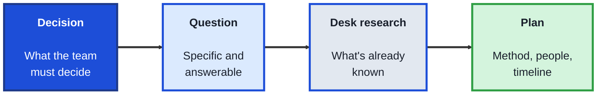
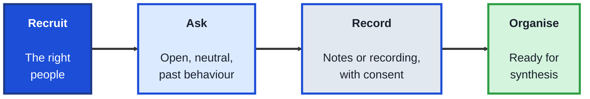
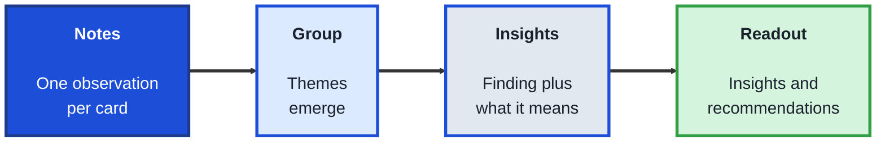

<!-- order: 5 -->
## Module 5: Research for Tech Teams

**Purpose of this module:** Find reliable answers to the questions teams make decisions on: what users need, what competitors do, and whether a change worked. Research roles, product coordinators, and analysts all need these skills, and none of them require code.

**Tools needed for this module:** A document tool, a free survey tool such as [Google Forms](https://forms.google.com), and a spreadsheet (Google Sheets or Excel). No coding required.

### Topic 5.1: Framing Research Questions

#### Concept

Good research starts with a good question. "What do users think?" produces a pile of opinions; "Why do new users stop before finishing sign-up?" produces answers a team can act on. Framing the question well, and checking what's already known, saves weeks of collecting the wrong information.

- A **research question** is specific, answerable, and tied to a decision the team needs to make
- **Desk research** (also called secondary research) reviews what already exists: reports, analytics, support tickets, competitor sites, and past studies
- **Primary research** collects new information directly, through interviews, surveys, or observation
- **Qualitative** research explores why and how, with words and observations; **quantitative** research measures how many and how much, with numbers
- A **research plan** records the question, the decision it informs, the method, who you'll learn from, and the timeline

#### Structure at a Glance


- If no decision depends on the answer, the research is probably not worth doing yet
- Desk research first often answers part of the question for free, and sharpens the rest

#### Where you'd actually use this

A team plans to redesign onboarding because "users find it confusing". Framing the real question, where exactly do new users drop off and why, and checking analytics first shows most leave at one identity-check step, so research focuses there.

#### Lab

1. **Name a real decision** a team or organisation you know needs to make.
2. **Write three research questions** for it, then rewrite each until it's specific, answerable, and tied to the decision. Keep the strongest one.
3. **Do 30 minutes of desk research:** collect at least three existing sources on the question, noting what each tells you and how reliable it is.
4. **Choose a method** (qualitative, quantitative, or both) and write one sentence on why it fits the question.
5. **Write a one-page research plan** covering the question, the decision, the method, who you'll learn from, and the timeline.

#### Checkpoint
You have a sharpened research question tied to a real decision, notes from three existing sources, and a one-page research plan.

#### Quiz
1. What makes a good research question?
2. What is desk research, and why do it first?
3. What is the difference between qualitative and quantitative research?
4. What goes into a research plan?
5. Why tie research to a decision?

*Answers: 1) It's specific, answerable, and tied to a decision the team needs to make. 2) Reviewing information that already exists; it often answers part of the question for free and sharpens the rest. 3) Qualitative explores why and how through words and observation; quantitative measures how many and how much with numbers. 4) The question, the decision it informs, the method, who you'll learn from, and the timeline. 5) So the findings change what the team does, rather than producing interesting facts nobody uses.*

---

### Topic 5.2: Interviews and Surveys

#### Concept

Interviews and surveys are the two most common ways to collect new information. Interviews go deep with a few people to understand why they do what they do; surveys go wide with many people to measure how common something is. Both are easy to do badly, usually by asking questions that push people toward the answer you expect.

- An **interview guide** lists open questions and follow-ups, but leaves room to follow what the person says
- **Open questions** ("Tell me about the last time you…") invite stories; **leading questions** ("Don't you find this confusing?") suggest the answer and should be avoided
- Asking about **past behaviour** ("What did you do last time?") gives more reliable answers than asking people to predict the future
- A **survey** should be short, ask one thing per question, and offer balanced answer options
- **Informed consent** means telling participants what the research is for, how their answers will be used, and that they can stop at any time

#### Structure at a Glance


- Five to eight well-chosen interviews often reveal the main patterns in a focused question
- Test every survey on two or three people before sending it; confusing questions produce misleading data

#### Where you'd actually use this

A team assumes users want more features. Six interviews about the last time each person used the product reveal they mostly want existing features to be easier to find, a finding a feature-wishlist survey would have missed.

#### Lab

1. **Write an interview guide** for your research question from Topic 5.1: a short introduction including consent, five open questions, and two follow-ups for each.
2. **Check your questions** for leading wording and future predictions, and rewrite any you find.
3. **Run two short interviews** (15 to 20 minutes each) with people who fit your research, taking notes on what they say and do.
4. **Build a five-question survey** in Google Forms on the same topic, with one idea per question and balanced answer options.
5. **Pilot the survey** with two people, ask them what confused them, and fix it before sending it more widely.

```lab
{
 "type": "sort",
 "title": "Good interview question or not?",
 "prompt": "Spot the questions that would give you reliable answers.",
 "buckets": [
  "Good: open and neutral",
  "Leading",
  "Asks them to predict"
 ],
 "items": [
  {
   "text": "\"Tell me about the last time you booked a class.\"",
   "bucket": "Good: open and neutral",
   "why": "Open, and about real past behaviour."
  },
  {
   "text": "\"Don't you find the booking page confusing?\"",
   "bucket": "Leading",
   "why": "It suggests the answer you expect."
  },
  {
   "text": "\"Would you pay $10 a month for this?\"",
   "bucket": "Asks them to predict",
   "why": "People are poor at predicting what they'll do; ask what they've done."
  },
  {
   "text": "\"What happened next?\"",
   "bucket": "Good: open and neutral",
   "why": "A neutral follow-up that invites the story."
  },
  {
   "text": "\"You'd use this every day, right?\"",
   "bucket": "Leading",
   "why": "It pushes them to agree."
  }
 ]
}
```

#### Checkpoint
You have an interview guide free of leading questions, notes from two real interviews, and a piloted five-question survey.

#### Quiz
1. When would you choose interviews over a survey?
2. Rewrite "Don't you find the app confusing?" as an open, neutral question.
3. Why ask about past behaviour instead of future intentions?
4. What does informed consent require?
5. Why pilot a survey before sending it?

*Answers: 1) When you need to understand why and how people behave, in depth, rather than measure how common something is. 2) For example, "Tell me about the last time you used the app." 3) People describe what they actually did more accurately than they predict what they would do. 4) Telling participants what the research is for, how their answers will be used, and that they can stop at any time. 5) To find confusing questions before they produce misleading data.*

---

### Topic 5.3: Synthesising and Sharing Findings

#### Concept

Raw notes aren't findings. Synthesis turns what you heard and measured into a small number of clear insights, backed by evidence, that a team can act on. Sharing them well matters as much as finding them: research nobody reads changes nothing.

- **Affinity mapping** groups individual observations (one per sticky note or card) into themes, so patterns emerge from the data
- An **insight** is a finding plus what it means, such as "Users skip the tutorial because they want to try the product first, so key tips should appear in context"
- **Evidence** such as quotes and numbers should support every insight, with how many participants it applies to
- A **recommendation** turns an insight into a suggested action the team can take
- A **research readout** shares the question, the method, three to five insights, and recommendations, in that order

#### Structure at a Glance


- Report how many people each finding applies to; "4 of 6 participants" is more honest than "users"
- Keep the readout short; link the full notes for anyone who wants detail

#### Where you'd actually use this

After eight interviews, affinity mapping shows three clear themes. The readout leads with the biggest one, backed by quotes from five participants, and the team changes its next sprint plan the same week.

#### Lab

1. **Write each observation** from your Topic 5.2 interviews on its own card or sticky note (a free online whiteboard works too).
2. **Group the cards into themes** without deciding the themes in advance, then name each group.
3. **Write three insights** in the form "finding, so implication", each supported by at least one quote and the number of participants it applies to.
4. **Turn each insight into one recommendation** the team could act on.
5. **Create a one-page readout** with the question, the method, your three insights with evidence, and your recommendations.

#### Checkpoint
You have themes built from your own interview notes, three evidence-backed insights with recommendations, and a one-page readout.

#### Quiz
1. What is affinity mapping?
2. What is the difference between a finding and an insight?
3. Why include the number of participants with each finding?
4. What does a research readout contain, and in what order?
5. Why keep the readout short?

*Answers: 1) Grouping individual observations into themes so patterns emerge from the data. 2) A finding is what you observed; an insight adds what it means for the team. 3) It shows how widespread the finding is, which is more honest than generalising to all users. 4) The question, the method, three to five insights, and recommendations, in that order. 5) Short readouts get read and acted on; full notes can be linked for detail.*

---

## Module 5 Completion Checklist
- [ ] Written a research plan with a question tied to a real decision
- [ ] Completed desk research using at least three sources
- [ ] Written an interview guide and run two interviews
- [ ] Built and piloted a five-question survey
- [ ] Synthesised findings into three evidence-backed insights and shared a one-page readout
