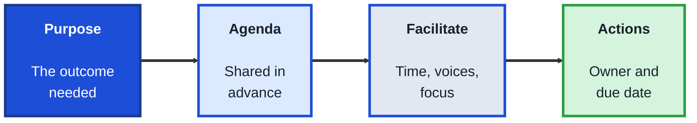
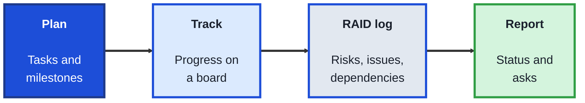
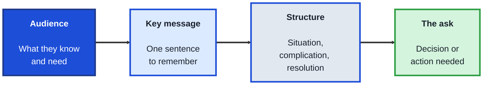

<!-- order: 6 -->
## Module 6: Communication and Delivery

**Purpose of this module:** Keep projects moving and people aligned: run useful meetings, track work and risks, and present clearly to any audience. These are the everyday skills of project coordinators, delivery managers, and anyone who helps a tech team ship.

**Tools needed for this module:** A document tool, a spreadsheet, and presentation software (Google Slides, PowerPoint, or Keynote). A free project board such as [Trello](https://trello.com) is useful but optional.

### Topic 6.1: Running Effective Meetings

#### Concept

Meetings are one of the most expensive things a team does: an hour with eight people costs a full working day. Effective meetings have a clear purpose, the right people, and a visible outcome. A facilitator's job is to get the group to that outcome, not to do most of the talking.

- Every meeting should have a **purpose** stated as an outcome, such as "decide on the launch date" rather than "discuss the launch"
- An **agenda** lists topics with time limits and is shared in advance, so people arrive prepared
- A **facilitator** keeps time, makes sure every voice is heard, and steers back to the purpose
- **Parking lot** items are important but off-topic points, noted to handle later so the meeting stays on track
- Every meeting should end with decisions and **action items**, each with an owner and a due date

#### Structure at a Glance

- If a meeting's purpose could be met by a written update, cancel it and send the update
- Ending five minutes early to confirm actions is worth more than five more minutes of discussion

#### Where you'd actually use this

A weekly status meeting has grown to an hour with twelve people. Replacing it with a written update plus a 15-minute call for blockers only gives the team back hours each week, and blockers get solved faster.

#### Lab

1. **Pick a meeting you attend regularly** and write its purpose as an outcome.
2. **Write an agenda** for its next session with timed topics, and share it at least a day ahead.
3. **Facilitate the meeting**, or observe it closely: keep time, invite quieter people in, and use a parking lot for off-topic points.
4. **Close with actions:** confirm each decision and action item, with an owner and a due date, before the meeting ends.
5. **Send a short follow-up** within a day listing decisions and actions, and ask two attendees what would make the meeting more useful.

#### Checkpoint
You've written an outcome-based purpose and a timed agenda, facilitated or observed a real meeting, and sent a follow-up with owned, dated actions.

#### Quiz
1. Rewrite "discuss the launch" as an outcome-based purpose.
2. Why share an agenda in advance?
3. What does a facilitator do?
4. What is a parking lot?
5. What should every meeting end with?

*Answers: 1) For example, "Decide on the launch date." 2) So people arrive prepared and the meeting can reach its outcome. 3) Keeps time, makes sure every voice is heard, and steers the group back to the purpose. 4) A list of important but off-topic points, noted to handle later. 5) Confirmed decisions and action items, each with an owner and a due date.*

---

### Topic 6.2: Tracking Delivery and Risk

#### Concept

Delivery is the work of getting a project from plan to done: knowing what's happening, spotting problems early, and making sure the right people know. Most failed projects don't fail suddenly; they fail through small delays and ignored risks that nobody tracked.

- A **work breakdown** splits a project into tasks small enough to estimate and assign
- A **dependency** is a task that can't start or finish until another one does; dependencies are where delays spread
- A **milestone** marks a significant point, such as "beta ready", used to check progress against the plan
- A **RAID log** tracks Risks, Assumptions, Issues, and Dependencies in one place, each with an owner
- A **risk** is something that might go wrong; an **issue** is something that already has; each risk needs a likelihood, an impact, and a plan

#### Structure at a Glance

- Review the RAID log weekly; a risk log nobody reads is just a list
- Raise a risk as soon as it's likely, not when it becomes an issue; early warnings leave more options

#### Where you'd actually use this

A launch depends on a partner delivering an integration. Logged as a dependency with a named owner and weekly check-in, a two-week slip is spotted a month ahead, and the team re-plans instead of missing the launch date.

#### Lab

1. **Choose a real or realistic project** with a clear goal and deadline.
2. **Break it into tasks and milestones**, and put them on a board or in a spreadsheet with an owner for each task.
3. **Mark at least three dependencies** between tasks.
4. **Create a RAID log** with at least two entries in each category, each with an owner; rate each risk's likelihood and impact and write a response.
5. **Write a one-paragraph status update** from your tracking that answers what happened, what's at risk, and what's needed.

#### Checkpoint
You have a task plan with milestones, owners, and dependencies, a RAID log with owners and risk ratings, and a status update drawn from it.

#### Quiz
1. What is a dependency, and why does it matter?
2. What does RAID stand for?
3. What is the difference between a risk and an issue?
4. What three things should every logged risk have?
5. Why raise a risk early?

*Answers: 1) A task that can't start or finish until another does; delays spread through dependencies. 2) Risks, Assumptions, Issues, and Dependencies. 3) A risk might happen; an issue already has. 4) A likelihood, an impact, and a plan (plus an owner). 5) Early warnings leave more options to prevent or reduce the problem.*

---

### Topic 6.3: Presenting to Stakeholders

#### Concept

Sooner or later every project needs to be explained to people who weren't part of it: leaders deciding on funding, customers seeing a demo, or teams who'll be affected. A strong presentation is built around the audience's question and the one thing you need from them.

- **Audience analysis** asks who will be there, what they already know, what they care about, and what decision they can make
- The **key message** is the one sentence you want the audience to remember; everything else supports it
- Structures such as **situation, complication, resolution** give a presentation a clear, logical flow
- **One idea per slide**, with a headline that states the point, keeps slides readable
- A **demo** shows real work; rehearse it and keep a backup (screenshots or a recording) in case something fails

#### Structure at a Glance

- Write slide headlines as full statements ("Checkout errors fell 40%"), not topics ("Checkout update")
- Rehearse aloud at least once, timed; most presentations run longer than planned

#### Where you'd actually use this

A team needs budget to fix a slow checkout. Instead of twenty slides of technical detail, a five-slide presentation leads with the lost sales, shows the fix and its cost, and ends with a clear ask. Leaders approve it in the meeting.

#### Lab

1. **Choose a real update or proposal** you could present: a project result, a recommendation, or your Module 5 research readout.
2. **Write an audience analysis** covering who, what they know, what they care about, and what they can decide.
3. **Write your key message** in one sentence, and your ask in one sentence.
4. **Build a five-slide presentation** using situation, complication, and resolution, with one idea per slide and statement headlines.
5. **Rehearse it aloud, timed,** for a friend or colleague, and ask them to repeat your key message back. Revise until they can.

#### Checkpoint
You have an audience analysis, a five-slide presentation with statement headlines and a clear ask, and a rehearsal where a listener could repeat your key message.

#### Quiz
1. What does audience analysis cover?
2. What is a key message?
3. Describe the situation, complication, resolution structure.
4. Why write slide headlines as full statements?
5. What should you prepare in case a demo fails?

*Answers: 1) Who will be there, what they already know, what they care about, and what they can decide. 2) The one sentence you want the audience to remember. 3) Describe the current situation, the problem or change that complicates it, then the resolution you propose. 4) The audience gets the point even if they only read the headlines. 5) A backup such as screenshots or a recording.*

---

## Module 6 Completion Checklist
- [ ] Written an outcome-based purpose and timed agenda, and run or observed the meeting
- [ ] Sent a follow-up with owned, dated action items
- [ ] Built a task plan with milestones, owners, and dependencies
- [ ] Created a RAID log with rated risks and written a status update from it
- [ ] Built and rehearsed a five-slide presentation with a clear key message and ask
