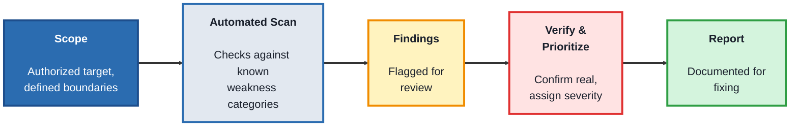
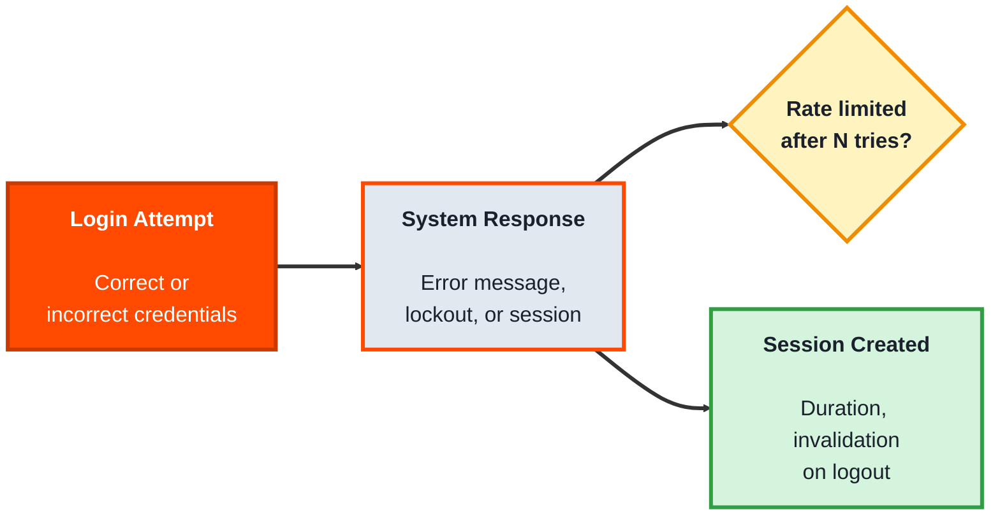
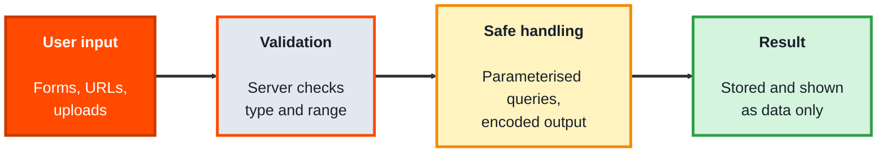

<!-- order: 8 -->
## Module 7: Security Testing

**Tools needed for this module:** [OWASP ZAP](https://www.zaproxy.org) (a free, open source security testing tool), and a deliberately vulnerable practice application to test against (the lab uses OWASP's own intentionally vulnerable training app, never test a system you don't own or have explicit written permission to test).

### Topic 7.1: Vulnerability Testing

#### Concept

**Vulnerability testing** is checking an application for weaknesses that could be exploited to cause harm, exposing data, bypassing controls, or disrupting the system, before someone with bad intent finds them first. As a QA activity, it's about systematically checking for well-known categories of weakness, not "hacking" in an open-ended sense, and it's always done against systems you're explicitly authorized to test.

- The **OWASP Top 10** is a regularly updated list of the most critical, common web application security risks (things like injection flaws, broken access control, and security misconfiguration), it's the standard reference point for what to check for
- A **vulnerability scanner** (like OWASP ZAP) automatically probes an application for known categories of weakness and reports what it finds, flagging things for a human to investigate further
- **Input validation testing** checks whether an application properly rejects or safely handles unexpected, malformed, or unusually long input, rather than assuming all input will be well-formed
- A finding's **severity** (critical, high, medium, low) reflects how much potential harm a specific weakness could enable if actually exploited, this drives how urgently it needs fixing

#### Structure at a Glance


- Automated scan results always need human verification, scanners flag *potential* issues, but confirming a finding is real (and not a false positive) is a distinct, necessary step before it goes into a report
- Defining **scope** before scanning, exactly what's authorized to be tested, is not optional, testing outside authorized scope, even accidentally, can have serious legal consequences

#### Where you'd actually use this

Any application handling sensitive data (personal information, payment details, credentials) needs recurring vulnerability testing, both to catch new weaknesses introduced by recent changes and to satisfy compliance requirements many industries are held to.

#### Lab

1. **Set up OWASP's intentionally vulnerable training application** (for example, OWASP Juice Shop, designed specifically to be tested against safely), running it locally.
2. **Install OWASP ZAP** and configure it to proxy traffic to your locally running training app.
3. **Run ZAP's automated scan** against the training app and review the findings it generates.
4. **Pick three findings** from the scan results, look up each one's category in the OWASP Top 10, and write one sentence per finding explaining what the underlying weakness actually is.
5. **Assign a severity** (critical, high, medium, low) to each of the three findings, and justify your reasoning for at least one of them in a sentence.

#### Checkpoint
You have real automated scan results from a training application, three findings mapped to OWASP Top 10 categories with plain-language explanations, and a justified severity rating for each.

#### Quiz
1. What is the OWASP Top 10, and why is it used as a standard reference?
2. What does a vulnerability scanner do, and why do its findings still need human verification?
3. What is "input validation testing" checking for?
4. Why does severity matter beyond just "is this a real problem"?
5. Why must scope be clearly defined before any vulnerability testing begins?

*Answers: 1) A regularly updated list of the most critical, common web application security risks; it's used as a standard reference because it represents an industry-wide consensus on which categories of weakness matter most and are most commonly seen. 2) It automatically probes an application for known categories of weakness and flags potential issues; findings still need human verification because scanners can produce false positives, flagging something that isn't actually exploitable or isn't a real issue in context. 3) Whether an application properly rejects or safely handles unexpected, malformed, or unusually long input, rather than assuming all input arriving will be well-formed. 4) Severity drives how urgently a finding needs to be fixed; without it, a team can't tell which of several real findings to prioritize first. 5) Because testing outside authorized boundaries, even by accident, can have serious legal consequences; scope defines exactly what's permitted to be tested before any testing activity starts.*

---

### Topic 7.2: Authentication Testing

#### Concept

**Authentication testing** checks specifically whether the systems that verify who a user is, login, password reset, session handling, actually hold up against realistic misuse, not just whether a correct username and password logs someone in successfully. Authentication is one of the highest-value targets for real attackers, which is why it gets tested as its own dedicated category rather than folded generically into vulnerability testing.

- **Credential testing** checks how the system responds to wrong passwords, repeated failed attempts, and whether it reveals too much information in error messages (like confirming a specific email exists in the system)
- **Session management testing** checks how login sessions are created, how long they last, and whether they're properly invalidated on logout, an improperly handled session can let access persist longer than intended
- **Account lockout / rate limiting** testing checks whether repeated failed login attempts are throttled or blocked, this is what prevents an attacker from simply guessing passwords indefinitely
- **Password policy testing** checks whether weak passwords are actually rejected as the system's stated policy claims they should be

#### Structure at a Glance


- Checking error messages specifically for information leakage (does "wrong password" vs. "no such account" reveal which emails are registered) is a small, easy check that's frequently overlooked
- Authentication testing, like all security testing, is performed only against systems you're explicitly authorized to test, and generally against a test or staging environment rather than a live production system with real user accounts

#### Where you'd actually use this

Any login-based application, verifying that account lockout actually kicks in after repeated failed attempts, that sessions expire and invalidate correctly, and that error messages don't quietly leak which accounts exist, checks that are easy to overlook but directly protect real user accounts.

#### Lab

1. **Using the same OWASP training application** from the Vulnerability Testing lab (or another authorized test environment with a login form), attempt to log in with an intentionally wrong password for a known valid username, and note the exact error message shown.
2. **Attempt a login with a username that doesn't exist at all**, using any password, and compare that error message word-for-word against the previous one, do they differ in a way that reveals whether an account exists.
3. **Attempt several rapid, consecutive failed logins** against the same account (five or so) and observe whether the system locks the account, introduces a delay, or shows any rate-limiting behavior at all.
4. **Log in successfully, then log out, and try re-using the same session (if you can inspect or replay the session token/cookie)** to see whether it was actually invalidated on logout.
5. **Try setting a password that's deliberately weak** (like `123` or `password`) if the app has a password policy, and confirm whether it's actually rejected as the policy would suggest.

#### Checkpoint
You have documented results for wrong-password vs. non-existent-account error messages, observed whether rate limiting kicked in after repeated failed attempts, and confirmed whether a logged-out session was actually invalidated.

#### Quiz
1. Why is authentication testing treated as its own dedicated category rather than just part of general vulnerability testing?
2. What is "session management testing" checking for?
3. What does account lockout or rate limiting protect against, specifically?
4. Give an example of how an error message itself can leak information, and why that's a problem.
5. Why should authentication testing be performed against a test/staging environment rather than a live production system with real accounts?

*Answers: 1) Because the systems verifying who a user is are one of the highest-value targets for real attackers, and testing them requires specific checks (session handling, lockout behavior, credential responses) that go well beyond a generic vulnerability scan. 2) How login sessions are created, how long they last, and whether they're properly invalidated on logout; the concern is a session persisting or remaining valid longer than intended. 3) An attacker simply guessing passwords repeatedly and indefinitely until one works, rate limiting or lockout prevents unlimited guessing attempts. 4) If a "wrong password" error and a "no such account" error are worded differently, an attacker can use that difference to determine which email addresses or usernames are actually registered in the system, even without ever guessing a correct password. 5) To avoid disrupting or exposing real user accounts and data during testing, deliberately triggering things like lockouts or repeated failed logins against a live system with real users could cause real harm or real account lockouts for actual people.*

---

### Topic 7.3: Input Validation Testing

#### Concept

Almost every serious web vulnerability starts with the same mistake: an application trusts what a user typed. **Input validation testing** checks that every field, URL parameter, and uploaded file is checked and safely handled, so input is treated as data and never as code. This is where testers find cross-site scripting and injection flaws, two of the most common and damaging weaknesses.

- **Validation** checks that input matches what's expected (a date is a date, a quantity is a positive number) and rejects the rest, on the server as well as in the browser
- **Output encoding** makes sure user text shown on a page is displayed as text, never run as part of the page
- **Cross-site scripting (XSS)** happens when a page displays user input without encoding, letting that input run as script in other users' browsers
- **Injection** happens when input is pasted straight into a database query or command; the fix is parameterised queries, never building queries from strings
- **Boundary and type testing** tries empty values, very long values, wrong types, and special characters, to see whether the app rejects them cleanly

#### Structure at a Glance


- Browser-side checks improve the user experience but prove nothing about security; anyone can send a request that skips them, so the server must check too
- A tester's job is to show the flaw exists and report it clearly, not to exploit it further

#### Where you'd actually use this

A comment box shows your text back on the page. You enter a comment containing simple HTML formatting and it appears in bold instead of as plain text, which shows the page isn't encoding output. You report it as a likely XSS risk with the exact steps, before an attacker finds it.

#### Lab

Use only **OWASP Juice Shop**, an application built to be attacked for training, running on your own computer. Never test a site you don't own or have written permission to test.

1. **Start Juice Shop locally** with Docker, then open `http://localhost:3000`:
   ```bash
   docker run --rm -p 3000:3000 bkimminich/juice-shop
   ```
2. **Map the inputs:** list every place a user can type or upload something (search, login, feedback, account fields).
3. **Try boundary and type inputs** in three of them: an empty value, a very long value, a value of the wrong type, and a short piece of HTML such as `<b>test</b>`. Note whether each is rejected cleanly or shown back unencoded.
4. **Run an automated scan** with OWASP ZAP against `http://localhost:3000` only, and read the input-related alerts it raises.
5. **Write one security bug report** for your most serious finding: the input, the steps, what happened, the risk, and the fix you'd recommend (server-side validation, output encoding, or parameterised queries).

#### Checkpoint
You have a map of Juice Shop's inputs, results from boundary and type testing on three of them, a ZAP scan of your local copy only, and one clear security bug report with a recommended fix.

#### Quiz
1. What is the difference between validation and output encoding?
2. What causes cross-site scripting?
3. What is the standard fix for injection into database queries?
4. Why isn't browser-side validation enough?
5. What is the one rule that applies before any security test?

*Answers: 1) Validation checks input is what's expected and rejects the rest; output encoding makes sure user text displayed on a page is shown as text, never run as code. 2) A page displaying user input without encoding it, so the input runs as script in other users' browsers. 3) Parameterised queries, which keep user input separate from the query itself. 4) Anyone can send requests directly to the server and skip the browser's checks, so the server must validate too. 5) Only test systems you own or have written permission to test.*

---

## Module 7 Completion Checklist
- [ ] Run an automated OWASP ZAP scan against an authorized training application
- [ ] Mapped three scan findings to OWASP Top 10 categories with plain-language explanations and justified severities
- [ ] Documented and compared error messages for wrong-password vs. non-existent-account login attempts
- [ ] Observed and recorded whether rate limiting/lockout triggered after repeated failed logins
- [ ] Confirmed whether a logged-out session was actually invalidated, and understands why authentication testing is always scoped to authorized, non-production environments
- [ ] Mapped every input in a local, intentionally vulnerable practice app
- [ ] Tested three inputs with boundary, type, and HTML values
- [ ] Run ZAP against your local copy only and written a security bug report with a fix
